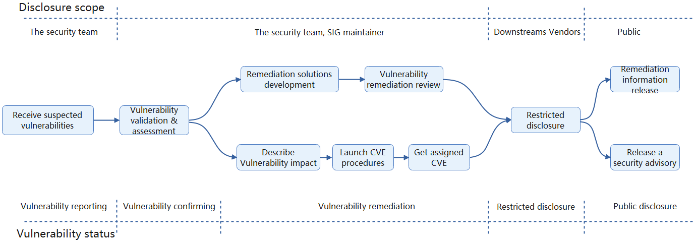

Karmada is a Kubernetes management system that enables users to run their cloud-native applications across multiple Kubernetes clusters and clouds. 
It is undoubtedly important to properly secure and monitor Karmada. This section provides guidance on securing Karmada and the security processes for the Karmada project.

## Security bulletins

For information regarding the security of this project, for any questions or discussions, use [Slack](https://cloud-native.slack.com/archives/C02MUF8QXUN) or [GitHub](https://github.com/karmada-io/karmada) to communicate with us.

## Discover Vulnerabilities

Security vulnerabilities are best handled swiftly and discretely with the goal of minimizing the total time users remain vulnerable to exploits.

Before you submit a vulnerability to the community, you might check the following before:

### When Should I Report a Vulnerability?

* You think you discovered a potential security vulnerability in Karmada
* You are unsure how a vulnerability affects Karmada

### When Should I NOT Report a Vulnerability?

* You need help tuning Karmada components for security
* You need help applying security related updates
* Your issue is not security related

### Typical Scene

* You discovered a security vulnerability while doing security testing
* You discovered a security vulnerability in another project that Karmada depends on

## Disclosure Process

If you discover a vulnerability, please email the security group at **email** with the following information:

* description of the problem, including what happened and what you expected to happen.
* precise and detailed steps that reproduced the problem
* environment in which the problem occurred and the affected versions
* any known mitigations or workarounds

The Karmada security response team will send an initial acknowledgement of the disclosure in 3-5 working days. If a response is not received during the period, please reach out to any Karmada maintainer directly to confirm receipt of the issue.
Once the vulnerability and mitigation are confirmed, the team will plan to release any necessary changes based on the severity and complexity. We’ll try to keep you informed about our progress throughout the process.

## Security release process

The following flowchart shows the vulnerability handling process. we will strictly handle the reporting vulnerability according to this procedure.

## Supported Versions

Karmada versions follow [Semantic Versioning](https://semver.org/) terminology and are expressed as x.y.z:

* where x is the major version
* y is the minor version
* and z is the patch version

The Karmada project maintains release branches for the most recent three minor releases. Applicable fixes, including security fixes, may be backported to those three release branches, depending on severity and feasibility.

Our typical patch release cadence is every 1-2 months. Critical bug fixes may cause a more immediate release outside of the normal cadence. We also aim to not make releases during major holiday periods.
